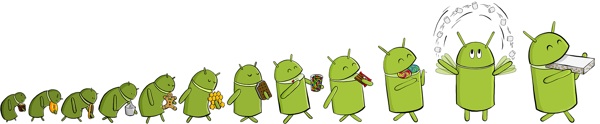

<head>

</head>

# The Evolution of Chat (Beta)

<!--  -->
<!-- http://www.bonkersworld.net/robot-evolution/ -->

This book guides you step-by-step through the evolution of messenging apps, from bulletin boards, to instant messaging right up to your very own Snapchat clone. As we journey from the earliest and most primative communication apps to the newest and shiniest we'll learn the how's and why's of app development.

## Standing on the Shoulders of Giants

> If I see further than you it's because I'm standing on the shoulder's of giants.

These famous words were supposedly uttered by Sir Isaac Newton. What he meant by this is that his work  - discoveries in optics, mathematics, astronomy and finance - would not have been possible without the work of his predecessors.

In much the same way, our ability to make video calls and send snaps to almost anywhere on the planet stands on the shoulders of decades of work by programmers who communicated via text.

## Assumptions

This books assumes that you have a Google account already, and that you know how to sign into Thunkable and create a new app. If you haven't made it that far yet, check out the appendices.