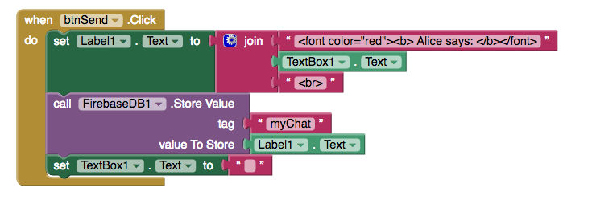

# AOL Instant Messenger

AOL launched their instant messenger in 1997 and it changed messenging for an entire generation. It dominated the IM market in North American, with millions choosing AIM over  alternatives such as ICQ or MSM. If you're too young to remember these pieces of software then do a quick search or check them out on YouTube.

The second app we're going to buid will be **T**hunkable **I**nstant **M**essenger, or TIM for short.

## How it works

The user interface is simple, and deliberately so. In essence all we need is a label, a button and a textbox. To get up and running quickly we'll use [firebase](https://firebase.google.com/) to handle incoming and outgoing messages. You don't need a firebase account to get the demo working, but if you plan on publishing your app to the Play Store then you should really [sign up](https://console.firebase.google.com/) for your own account.

## What You'll Be Building
A peer-to-peer chat app that highlights who is speaking with colourful usernames and which updates in real time.

## Design

This minimal design is very similar to Thunkaboards, but we take greater care with the positioning of the components. In the `Layout` drawer of the designer we can find horizontal and vertical arrangements which give us great control over component positioning. We have a label, with width and height set to fill parent, and scrollable is selected. In order to change the colour of the text in the label, make sure that the HTML Format property is also selected. 

## Blocks

The blocks are a little more complex than the previous app as we need a bit more background knowledge to understand everything. We'll learn a little bit about how computers display colours and how to represent data using  HTML. In order to get everything working we need to break all of these requirements into a set of smaller, simpler sub-tasks to do. The whole point of this app is to transmit messages instantly, so we'll start there, but there are several points to cover so we'll outline them here:

1. Send data with Firebase
3. Use HTML to format strings
2. Create a Procedure
4. Learn about Colours

### 1. Real-Time Chat with Firebase

The most techincally demanding aspect of this entire project is handled with the firebase component. Since being acquired by Google in 2015, firebase has exploded in popularity. With nothing more than a Google account (GMail, G Suite etc) you can create powerful, fast and reliable databases with just a few clicks. 

As with the TinyWebDB in our first app, we use tags to identify different collections of data. When our app loads we want to get all the data associated with that tag or, if it's the first time that the app have ever been used, use a fallback in case the tag is not there yet. As soon as firebase replies to the `Get Value` request the `FirebaseDB1.Got Value` is triggered. Here we display the value in our label.

An incredible thing happens with the `FirebaseDB1.Data Changed` event. If *anyone* uploads data to our firebase, then the data changed event is fired **for all users** of the app..."automagically!" This is basically a better version of our previous app, made possible thanks to improved technology. 

While sending plain text across the web is great and all, it would be nice to more closely emulate AIM, and to do this we'll have to learn a little bit about a second programming language, **H**yper**T**ext **M**arkup **L**anguage, or HTML to its friends.

### 2. HTML

HTML is the language of the web, every day billions of web pages are displayed in browsers of all shapes and sizes, and HTML is the language used in almost all of them. There are many excellent, free (and paid) tutorials availabe online, and especially on YouTube, so I'll leave it to you for find one that you like.

In HTML, content that you want to display on screen is "marked-up" using a series of HTML tags. Some Thunkable components, such as the label, also support HTML tags; try out the following code for yourself:

This piece of code displays the speakers name in red and bold text, followed by their message which is displayed normally. 
We also store the *text* from label1 in our Firebase, using the tag "myChat". This is important to recognise because it only stores the text, and **not** any of the HTML data we have added. This means that users on other devices will see the correct information, but the colours and fonts will not be as we intended them.
In order to display the conversation as we, the developer, intended it for all users, we will have to write the raw HTML to a string variable and then save the string in Firebase. This gives us something like the following:

<!-- store html -->
<!-- display html from firebase -->

### 4. Colours

It is also very useful to understand how computer represent colours. All our screens today are made up of pixels - tiny dots of colour that can be either red, green or blue. It sounds simple, but when you combine millions of pixels, and give them the ability to change colours 60 times per second, this enables us to see moving pictures on everything from smart watches up to flat-screen televisions.

Now we know that pixels can be eiter red, green, blue, or any combination of these three - giving us a wider variety of colour to choose from. In between black and white there are lots of shades of grey, and in much the same way we can vary the precise ammounts of red, green and blue to produce over 16 million different colours. This is because the engineers who developed colour displays choose to use 8 bit numbers to quiatify exactly **how much** red, green or blue we can see. 8 bit numbers can be anyone of 256 possible values, ranging between 0 and 255. Multiplying 255 x 255 x 255 will give us over 16 million. 

If we use decimal numbers to represent colours then this is known as an RBG  value. For example, green is made with (0, 255, 0) and purple created by mixing red and blue (255, 0, 255).

In the earliest days of computing each bit of memory was a precious commodity, using as many as 13 characters to represent a single colour wasn't efficient enough so instead a differnet counting system was used. Hexadecimal, has 16 digits, rather than the standard 10 that we are used to in decimal, 0-9 followed by A-F. Hex colors have two bits for red, two for green and two for blue. We still end up with as many colours but using only 6 of 7 characters, so this was a significant space saving for early computers. Using the previous examples green would be 00FF00 and purple would be FF00FF. 

## Chat Bot

## Recap

In this chapter we've learned about:

