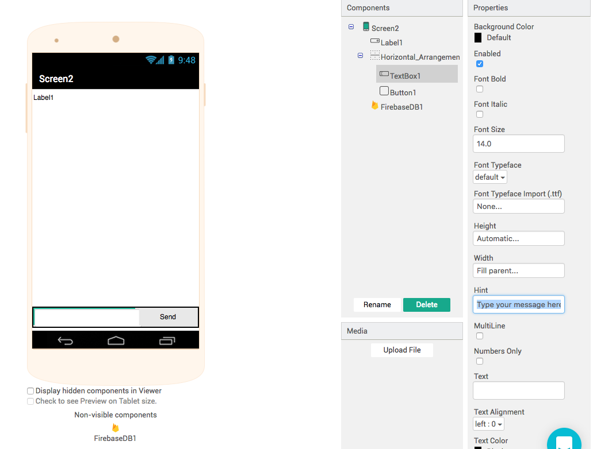

# Thunkable Instant Messenger

The second app we're going to buid will be **T**hunkable **I**nstant **M**essenger, or TIM for short. This app will be based on the 90s instant messaging phenomenon - AIM.

AOL launched their instant messenger in 1997 and it changed messenging for an entire generation. It dominated the IM market in North America, with millions choosing AIM over  alternatives such as ICQ or MSM. If you're too young to remember these pieces of software then do a quick search or check them out on YouTube.

	<h3 class="alert-heading">
	<i class="fa fa-commenting">&nbsp;</i>
	Community</h3>
	If you have any questions about this chapter feel free to ask over in the <a href="http://community.thunkable.com/t/teoc-2-thunkable-instant-messenger/2774?u=domhnall" class="alert-link"> Thunkable community forum</a>

## How it works

The user interface is simple, and deliberately so. In essence all we need is a label, a button and a textbox. To get up and running quickly we'll use [firebase](https://firebase.google.com/) to handle incoming and outgoing messages. You don't need a firebase account to get the demo working, but if you plan on publishing your app to the Play Store then you should really [sign up](https://console.firebase.google.com/) for your own account.

## What You'll Be Building
In this app we'll learn how to add aditional screens, and how to pass information between screens. On the first screen we'll show the user a basic log in screen, while on the second scree we'll be creating a peer-to-peer chat app that highlights who is speaking with colourful usernames and which updates in real time.

<a href="https://github.com/domhnallohanlon/thunkable_book_1/blob/master/aia/TIM_template.aia" download class="flat_btn"><i class="fa fa-cloud-download"></i>
	Download the .aia Template.
</a>
<a href="http://app.thunkable.com/?repo=raw.githubusercontent.com/domhnallohanlon/thunkable_book_1/master/aia/TIM_template.asc" class="flat_btn" target="_blank">
	<i class="fa fa-clone"></i> Clone in Thunkable
</a>

## Screen1 Design

All the components for the design of Screen1 come from the User Interface palette. The TextBox and PasswordTextBox, as their names imply, are used to enter plain text and password text and we will use them to get the users name and password. When the button is pressed the app will try to sign the user in, and if they make a mistake we will use the notifier to tell them to guess again.

## Screen1 Blocks

The scenario here is not supposed to provide a high level of encryptyion or security, but rather to show how data can be sent between two screens. In this first snippet we see a global variable used to store our password. When the button is pressed we check whether the user has typed the correct password in the PasswordTextBox. If the passwords match then we open "Screen2" and pass the username from the TextBox, as the start value to Screen2.  

In the first example we're making the assumption that the user always knows the correct password, or that the user never makes mistakes - both of which are dangerous assumptions to make! To improve the UX we'll use the notifer component to create a pop-up if they ever get the password wrong. Just like the join block in our first app, the if block also has a mutator that we can use to add additional test conditions. In this app the password is either right or wrong so we only need if and else.  

That's it really for Screen1, we've learned about opening new screens, using start values and if-then-else in quick succession so this might be a good opportunity to go back and re-read what we've just covered before moving on to the next screen.

## Screen2 Design 

This minimal design is very similar to Thunkaboards, but we take greater care with the positioning of the components. In the `Layout` drawer of the designer we can find horizontal and vertical arrangements which give us great control over component positioning. We have a label, with width and height set to fill parent, and scrollable is selected. In order to change the colour of the text in the label, **make sure that the HTML Format property is also selected**. 

<!--  -->

## Screen2 Blocks

The blocks are a little more complex than the previous app and we need a bit more background knowledge to fully understand everything. We'll learn a little bit about how computers display colours and how to represent data using  HTML. In order to get everything working we need to break all of these requirements into smaller, simpler sub-tasks. The whole point of this app is to transmit messages instantly, so we'll start there, but there are several points to cover so here's a quick overview:

1. Greet the user by name
2. Send data with Firebase
3. Use HTML to format strings
4. Create a Procedure
5. Learn about Colours

### 1. Greet the User by Name

Recall that on Screen1 we sent the username as a start value to Screen2. To start off we will get that username and personalise the title bar with thier name. You can find the get start value block in the Control palette.

### 2. Real-Time Chat with Firebase

The most techincally demanding aspect of this entire project is handled by the Firebase component. Since being acquired by Google in 2015, Firebase has exploded in popularity. With nothing more than a Google account (GMail, G Suite etc.) you can create powerful, fast and reliable databases with just a few clicks. 

As with the TinyWebDB in our first app, we use tags to identify different collections of data. When our app loads we want to get all the data associated with that tag or, if it's the first time that the app have ever been used, use a fallback in case the tag is not there yet. As soon as firebase replies to the Get Value  request the FirebaseDB1.Got Value is triggered. Here we display the value in our label.

<!-- update this to Screen2 -->

An incredible thing happens with the FirebaseDB1.Data Changed event. If *anyone* uploads data to our firebase, then the data changed event is fired **for all users** of the app..."automagically!" This is basically a better version of our previous app, made possible thanks to improved technology. 

While sending plain text across the web is great and all, it would be nice to more closely emulate AIM, and to do this we'll have to learn a little bit about a second programming language, **H**yper**T**ext **M**arkup **L**anguage, or HTML to its friends.

### 3. HTML

HTML is the language of the web, every day billions of web pages are displayed in browsers of all shapes and sizes, and HTML is the language used in almost all of them. There are many excellent, free (and paid) tutorials availabe online, and especially on YouTube, so I'll leave it to you for find one that you like.

In HTML, content that you want to display on screen is "marked-up" using a series of HTML tags. Some Thunkable components, such as the label, also support HTML tags; try out the following code for yourself:

<!-- change to Button1 -->

This piece of code displays the speakers name in blue and bold text, followed by their message which is displayed as plain text. 
We also store the *text* from label1 in our Firebase, using the tag "myChat". This is important to recognise because it only stores the text, and **not** any of the HTML data we have added. This means that users on other devices will see the correct information, but the colours and fonts will not be as we intended them.
In order to display the conversation as we, the developer, intended it for all users, we will have to can write the raw HTML to a string variable and then save the string in Firebase, or we could just join together the all the HTML tags in one join block. This gives us something like the following:

<!-- store html -->

### 4. Procedures

In the previous code we have created a join block and then duplicated it to display the HTML in the label and store it in our Firebase at the too. It is generally considered bad practice to have repetition like this in your code, and you will often hear about DRY programming, or **D**on't **R**epeat **Y**ourself.

This is a excellent opportunity to learn a bit about procedures.

A procedure is a set of instructions that are followed in a specific order and which can be reused over and over again. If, for example, you were baking cookie would would have to weigh the ingredients, then mix them and finally bake them. A procedure is just like a recipe for your app. The instructions are always following in the precise order you define them, and anyone following your recipe should always end up with the same result. 

In the next example we create a procedure called "generateHTML". In the procedure we change the text colour from blue to green and then call the procedure to display the contents in the label and call it again to store html in Firebase.

Finally, to illustrate the different types of procedures in Thunkable, we create a new variable called "storeHTML". This procedure generates HTML formatted text and joins it on to our conversation.

If you want a wider selection of colours to choose from than just pre-defined colours like "red" or "green" you can get more choice (a lot more choice!) by specifying a hexadecimal colour code instead. We can make the text teal by using the following:

To understand more about hex, and how colours are represented in code read on!

### 5. Colours

It is also very useful to understand how computer represent colours. All our screens today are made up of pixels - tiny dots of colour that can be either red, green or blue. It sounds simple, but when you combine millions of pixels, and give them the ability to change colours 60 times per second, this enables us to see moving pictures on everything from smart watches up to flat-screen televisions.

<figure>
	
	<figcaption>A close up of different types of pixels. Image courtesy of <a href="https://commons.wikimedia.org/wiki/File:Pixel_geometry_01_Pengo.jpg#/media/File:Pixel_geometry_01_Pengo.jpg" target="_blank">Wikipedia</a></figcaption>
</figure>

<!--  -->

Now we know that pixels can be eiter red, green, blue, or any combination of these three - giving us a wider variety of colour to choose from. In between black and white there are lots of shades of grey, and in much the same way we can vary the precise ammounts of red, green and blue to produce over 16 million different colours. This is because the engineers who developed colour displays chose to use 8 bit numbers to quiatify exactly **how much** red, green or blue we can see. 8 bit numbers can be any one of 256 possible values, ranging between 0 and 255. Multiplying these three 8 bit values together - 255 x 255 x 255  - will give us over 16 million different combinations. 

If we use decimal numbers to represent colours then this is known as an RGB  value. For example, green is made with (0, 255, 0) and purple is created by mixing red and blue (255, 0, 255).

In the earliest days of computing each bit of memory was a precious commodity so using as many as 13 characters to represent a single colour wasn't efficient enough. Instead a differnet counting system was used called Hexadecimal. Hexadecimal, or hex, has 16 digits, rather than the standard 10 that we are used to in decimal, 0-9 followed by A-F. Hex colors have two bits for red, two for green and two for blue. We still end up with the same amount of colours but using only 6 or 7 characters. Since this was a significant space saving for early computers it was widely adopted and remains common to this day. Representing the previous examples in hex, green would be 00FF00 and purple would be FF00FF. 

In the following snippet, colour values are copied from [materialui.co](http://materialui.co/colors) and pasted directly into Thunkable.

<!-- 
## Chat Bot
 -->
## Recap

In this chapter we've learned about:

Procedures - like a recipe, procedures run the same code, in the same order

Start Values

HTML

RGB and RGBa Values

Hexadecimal Colour Values