# In the Beginning was BBS

One of the earliest methods of communication on the internet was through message boards, or bulletin board systems. Using this software users could:

1. Type messages on their own computer.
2. Upload their messages to a server for others to read.
3. Download messages that others had written, from the server.

We will try and replicate these three features in our first app. Before doing so it is important to remember that we have to break big, complex problems into a series of smaller, more managable challenges. 

As an homage to these early boards we will call our first app, Thunka-boards:

<h3 class="alert-heading"><i class="fa fa-commenting">&nbsp;</i>Community</h3>
	If you have any questions about this chapter feel free to ask over in the <a href="http://community.thunkable.com/t/teoc-1-thunkaboards/2773?u=domhnall" class="alert-link"> Thunkable community forum</a>

## 1. Display Text in a Label

To get started with we'll take some text from a textbox and display it in a label.

### Design

The design for this app is really simple. You just need three components; a label, a textbox and a button. Simply drag-and-drop the components from the palette on the left onto Screen1 in the middle.

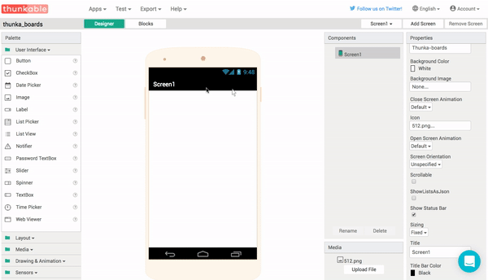

It **is** possible to rename components, and for larger apps I strongly recommend doing this, but for now we will have three components on Screen1 with their default names. The option to rename components is at the bottom of the component view, right next to the delete button.

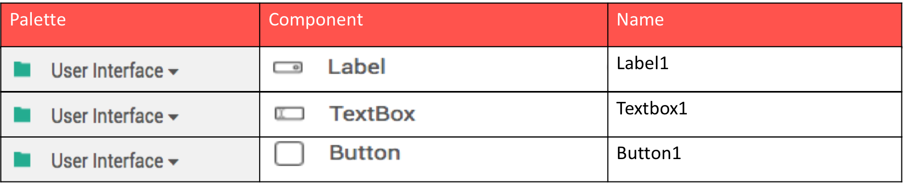

And your app will, initially at least, look like this:

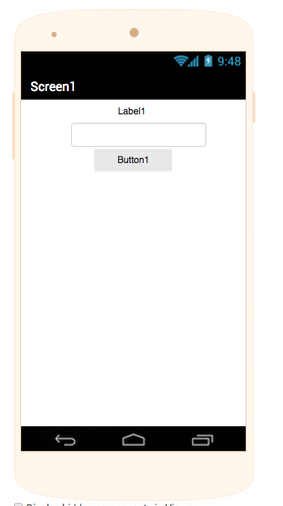

By default, all components are aligned to the center of the screen. On the right hand side of the screen you can see the component properties. Let's change things a bit, like the fonts, backgrond colour, width and height. Try experimenting with the properties to make it look a bit more user friendly:
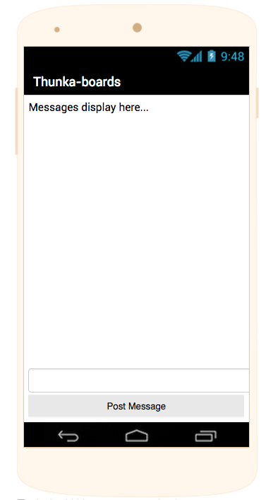

If you'd like to use one of the pre-made templates just click on the buttons below.

<!-- <button>Open Design in Thunkable</button>
 -->
<a href="https://github.com/domhnallohanlon/thunkable_book_1/blob/master/aia/thunka_boards_template.aia" download class="flat_btn"><i class="fa fa-cloud-download"></i>
	Download the .aia Template.
</a>
<a href="http://app.thunkable.com/?repo=raw.githubusercontent.com/domhnallohanlon/thunkable_book_1/master/aia/thunka_boards_template.asc" class="flat_btn" target="_blank">
	<i class="fa fa-clone"></i> Clone in Thunkable
</a>

### Blocks

The code for this app is reasonably straightforward. The block When Button1.Click is what we call an event handler - it is waiting to a particular event to happen. In this case, **When** the button is clicked we **get** the text from TextBox1 with the Textbox1.text block and then **set** it as the text in Label1 using the set Label1.text block. For this reason these blocks are often referred to as getters and setters. As we drag and drop the blocks together they snap together like puzzle pieces - simples!

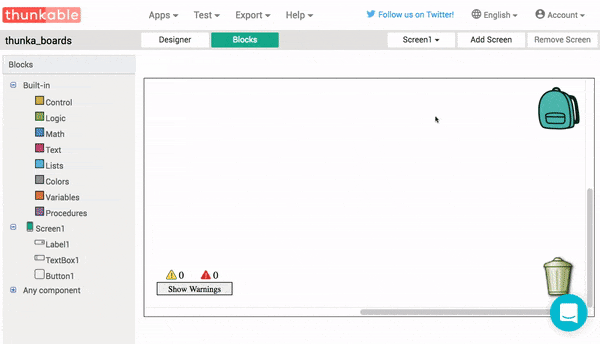

<!-- 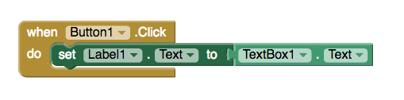 -->

Once we've got this very basic app working it's time to add in some more code to make it work even better. The pink join block comes from the text drawer. With a bit of practice, having colour coded blocks will be very helpful when we're following along with future tutorials. 

In our bulletin board we want to add new messages into the thread below the old messages, so we need a way to add text into a new line. In order to display these new messages on their own line we use the *\n* escape character. This behaves just as if you pressed the <kbd>Return</kbd> key on your keyboard.

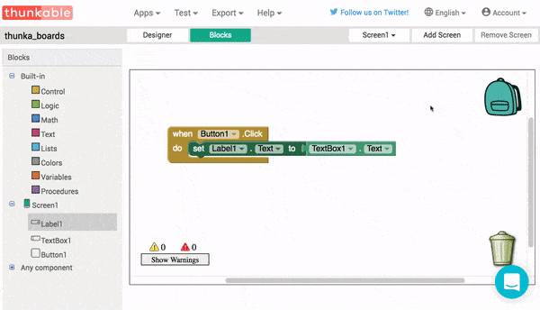

When using Thunkable, you will see many blocks with a blue gear icon on them. This is known as a **mutator** because it allows you to mutate - or alter - the shape of a block. The snippet below is **not** part of our app, but it just demonstrates how mutators can be used to change the shape of some blocks, so be on the look out for them!

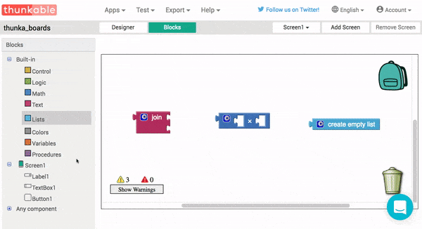

Finally, we can improve the overall user experience (UX) of this app by clearing out TextBox1 after we have got the text from it. This is achieved by setting the text property to be an empty piece of text, also known as an empty **string**.

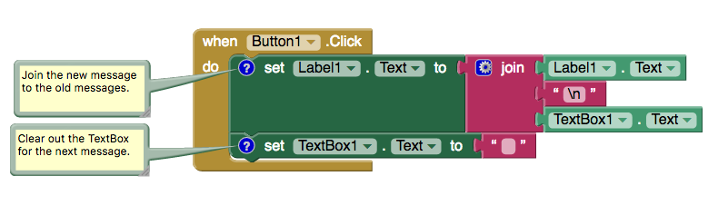

The blue question marks that you see on the blocks here are called **comments**. These are notes that the programmer writes to explain what a certain block, or group of blocks, should do. If you're using any of the templates you will find some comments to help you out. Try right-clicking on a block now and adding in some comments of your own.

### What's Happening?

When anything happens on your phone, from pressing a button up to recieving a phone call, your phone handles this as an event. Something has happened and you phone has to deal with it. In our app we take text from one component and display it in another, but in future apps the idea of event handlers is going to be very important. 

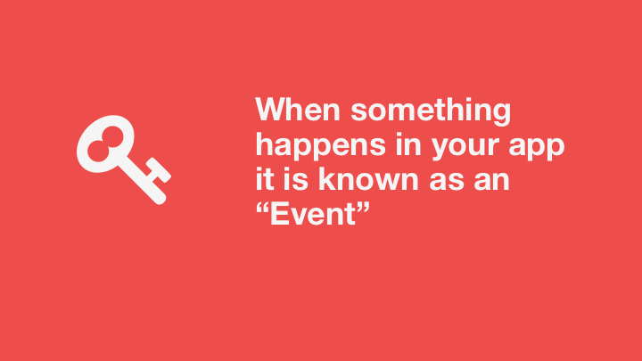

In our app, any time that the button is pressed the When Button1.Click event happens. The code inside the event then happens in order, starting at the top and working its way downwards. 
First the label is changed to show the new message. The dark green set Label1.text block is known as a **setter** because it allows us to write, or set, new data in place of old. In our app we are replacing the old text in Label1 with new text which we get from TextBox1. The light green TextBox1.Text and Label1.text blocks are known as **getters** because the allow us to read - or get - data from a component.

## 2. Upload the Text

At the moment all our messages are stored (temporarily!) on our phone only. This is fine for a note taking app, but it's not much use for communication. Let's add some more components to our app to communicate with the cloud. 

### Design

This is the first time we've seen a non-visible componet. This simply means that the component does not appear on screen, but we can program it in just the same way that we would program any other component.

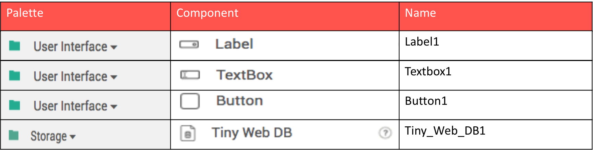

If you're using a component for the first time it is usually a good idea to consult the documentation (docs) to learn more about how it works. For instance, you can find all the documentation for the storage components - including the TinyWebDB - [here](http://thunkable.com/reference/components/storage_components.html)

### Blocks

TinyWebDB will work fine right out of the box, but be aware that you will need to set up your own cloud service if plan on having lots of users. You can read more about this in the [Thunkable Documentation](http://thunkable.com/explore/custom-tinywebdb-service.html)

### What's Happening?

The first thing we want to do is use the Tiny_Web_DB1.Store Value block to save the text from the label to the database. We can store any type of variable in the database, like text, numbers and even lists, but we need a way to keep track of all this. Tags are used like headers, or titles, to keep everything organised. I've used the tag "app_development" here but you can use anything you like really.
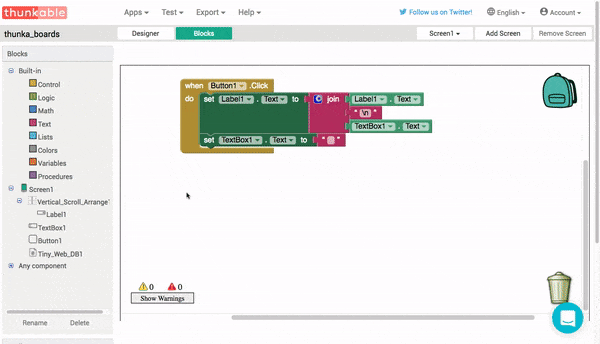

Once the text is successfully stored in the database we want to display the new value on the screen for the user to see the updated conversation. The first step of this is handling what happens when the ValueStored event is triggerd. In this snippet we just ask database for the data by using the Tiny_Web_DB1.Get Value block.  
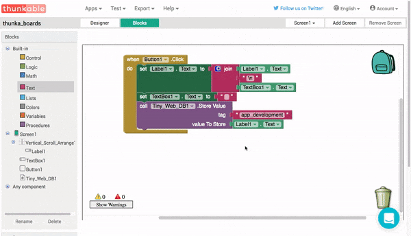

Now that we have the new value we can display it in the label. In the next snippet, the Got Value event returns two variables for us to use. The tagFromWebDB will just be "app_development" or whatever tag you have decided to use, so we're only interested in the valueFromWebDB varaible. You will see lots of blocks with variables like this, all you have to do is hover  the mouse over the variable name to show the drop-down menu with the getter and setter.
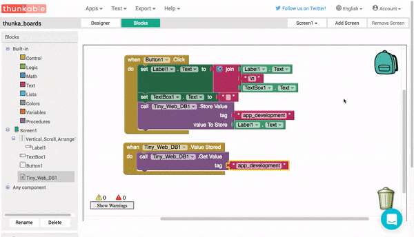

All our messages are stored online, but they aren't displayed until the user types in a new message, what we need now is to make the messages show up when the app is opened. To make something happen when the screen loads we use the Screen1.Initialize block. Any blocks stored here will run when the app starts.  
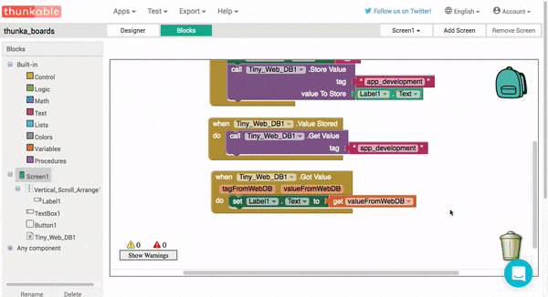

Finally, everytime the user refreshes the app we want the thread to update everytime the user clicks on a refresh button. To get Button2, we go back to the Designer view and add a second button from the user interface palette. Once the Button2.Click event is added we can duplicate the Tiny_Web_DB1.Get Value block for a third and final time. 
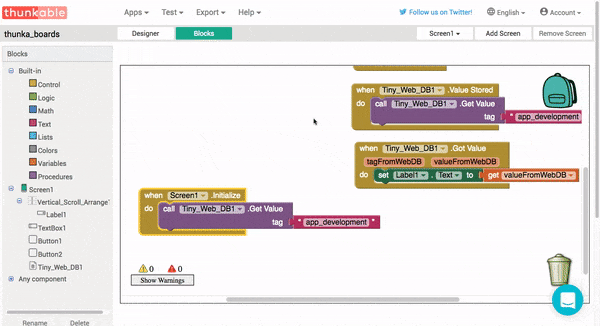

## Progression

Now that you have the ability to capture text input and you're familiar with the TinyWebDB, why not try and make a note taking app? Apps like [Evernote](https://play.google.com/store/apps/details?id=com.evernote) are hugely popular and they allow user to save notes both on their phones and in the cloud.

## Recap

In this chapter we've learned about:

Variables - data which can change  
Getters - for getting, or reading, a value from a variable  
Setters - for setting, or writing, a value to a variable.  
Mutator - for changing the shape of a block  
Comments - leaving notes for other humans  
Strings - pieces of text  

## Up Next

Everything here looks great - the only drawback is that our user has to constantly refresh the app to check for new messages. This is ok for infrequent communication like a forum, but in the next app we'll take a look at moving from this pull based system to a push based one to enable real-time chat.

