## Overview

Extensions allow us, as Thunkable developers, to add extra functionality our apps. It is also possible to use the Java programming language to write custom extensions, but in this article we will focus on two that have been developed by members of the Thunkable community, Mika and Helios.

Mika's [*Image Editor Extension*](#iee) allows us to manipulate a digital images in a huge variety of ways.

In Helios' [*Colours Extension*](#ce) we can easily manipulate colours and quickly add in colours in hex format.

## Installing an Extension

Extensions are <code>.aix</code> files that need to be downloaded from the developer and uploaded to Thunkable. Sometimes develpers will give away their extensions for free, and other times they will charge for them. In either case don't forget to thank them with likes, shares, retweets etc if you appreciate their work and get in touch directly with them if you have any questions. 

## Image Editor Extension {#iee}

<h3 class="alert-heading">
	<i class="fa fa-commenting">&nbsp;</i>
	Community</h3>
	Check out the Thunkable Community to find out more about <a href="http://community.thunkable.com/t/image-editor-extension-no-internet-connection-required/2495?u=domhnall" class="alert-link"> the Image Editor Extension</a>

This powerful extension provides lots of features for editing images right from your app. One of the main benefits of this extensions is that, once installed, you user does not need to have an internet connection to use it. The full extension can be dowloaded from the Thunkable community, along with Mika's documentation and sample app.

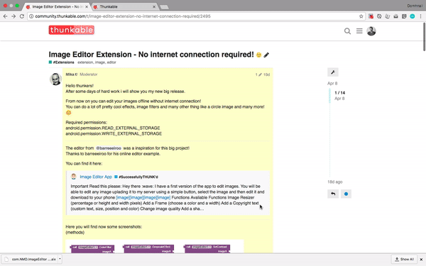

### Colour Filter
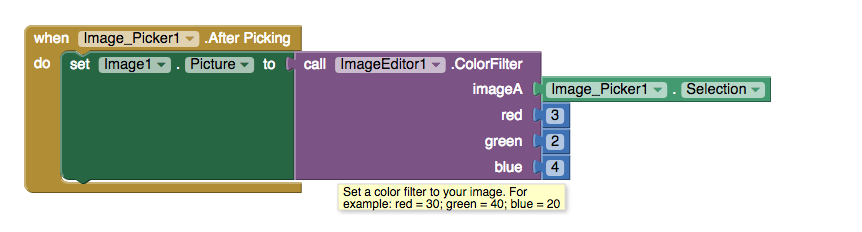

### Greyscale
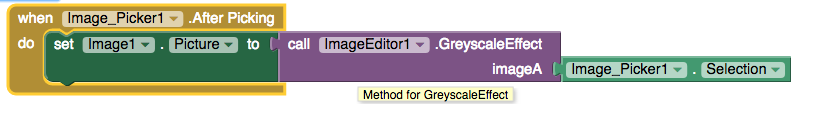

### Flip
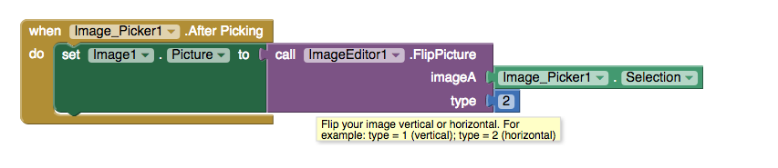

### Tint
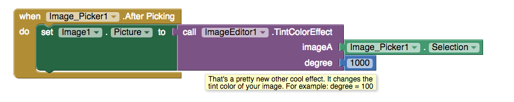

## Colours Extension {#ce}

<h3 class="alert-heading">
	<i class="fa fa-commenting">&nbsp;</i>
	Community</h3>
	Check out the Thunkable Community to find out more about <a href="http://community.thunkable.com/t/colours-extension/2513?u=domhnall" class="alert-link"> the Colours Extension</a>

The full extension can be dowloaded from the Thunkable community, along with Helios' documentation and sample app.

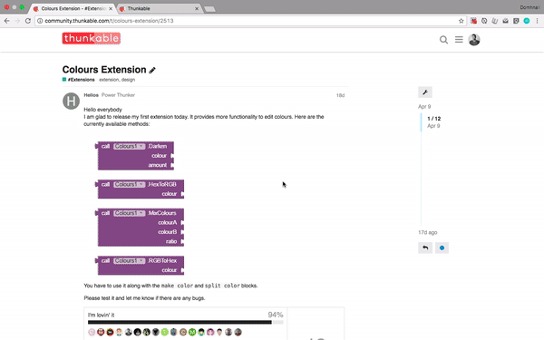

### HexToRGB {#h2r}

The Colours1.HexToRGB block takes a #HEX colour and converts it into a lisp list in the format (R G B). 

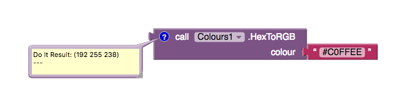

Note that you must include the # symbol otherwise the missing character will generate a runtime error such as <code>length=6; regionStart=5; regionLength=2</code>

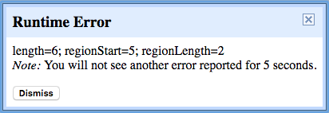

### RGBToHEX {#r2h}

The Colours1.RGBToHex block takes a lisp list and converts it to a #HEX format number.

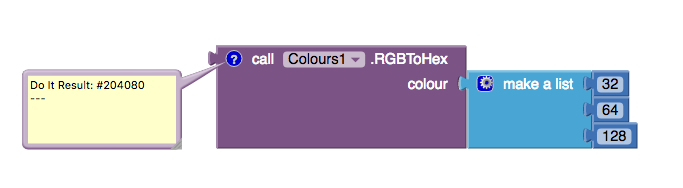

### Lighten & Darken {#landd}

Both the lighten and darken blocks require two input aruments. 
The **colour** input expects a list in the form (R G B), rather than an integer as an input.
The **amount** input expects an input anywhere between 0 and 1.

The lighten and darken blocks return a (R G B) list, so if you want to apply this as a text or background colour somewhere in your app make sure you pass it through a make color block, which you can find in the colours category of blocks, but you have to remove the make a list block first. 

Here are two basic examples of using the lighten and darken procedures.
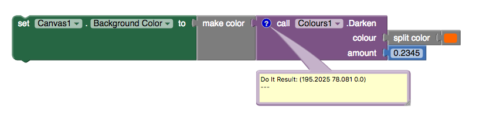
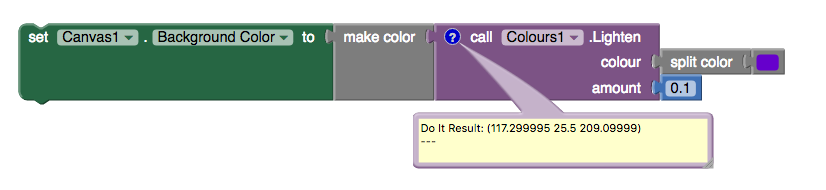

### Mix Colours {#mix}

In keeping with the previous blocks, the inputs for this block, <code>ColourA</code> and <code>ColourB</code> are (R G B) lists, and the <code>amount</code> argument accepts a number anywhere between 0 and 1.

The example below shows how use either a default colour or a custom colour as an input and mix them together. 

Again, the return type from this block is a (R G B) list so don't forget to pass it through a make color block if you want to use it to assign a colour to a component in your design.

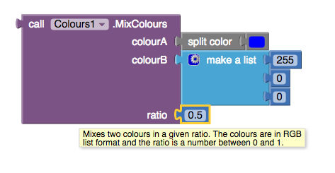

