# Thunkchat

In September 2011, three college students - working out of their dormroom in Stanford - revolutionised the messaging world with their app, Snapchat.

<!--  -->

We'll try and emulate this viral sensation by building an app which contains the following addictive features:

1. The ability to capture pictures,
2. Draw doodles,
3. Add text,
4. Filter images,  
5. Geofilters.

## Community

If you have any questions about this chapter feel free to ask over in the [thunkable community forum](http://community.thunkable.com/t/teoc-3-thunkchat/2775?u=domhnall)

## 1. Capture & Display Pictures

We'll start with a simple prototype, and then add more components as we go when we need more funcitonality. Our initial design has a big canvas for displaying images and a circular button to take the picture. To create circcular buttons you need to change the shape to `oval` and set the height and width to be the same amount, i.e. 48px width and 48px height or 32px width and 32px height.

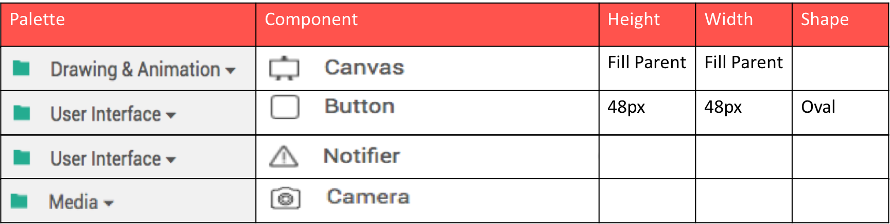

Taking a photo and displaying it on the screen is actually really easy. First of all, the button click event calls the Camera1.Take Picture method. This in turn opens the camera and lets the use take a photograph. Once the user has taken a picture this raises the Camera1.After Picture event. This event contains an image variable, which tells us the path to where the photo is stored on the phone. 

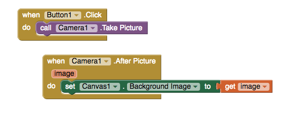

## 2. Draw a doodle

Drawing a line anywhere on the screen only takes 6 blocks. The dragged event is fired whenever the user drags their finger around the screen. 

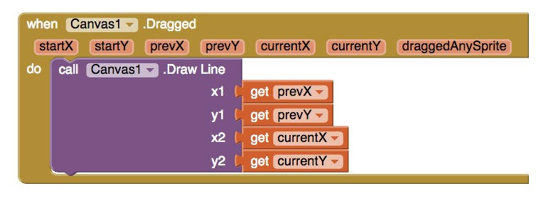

You might remember from math(s) class  that a line is just the shortest distance between two points. Since a screen is just a collection of points basically all we're doing here is joining the dots. 

The canavs component gives us the option to change a wide variety of properties, such as paint color, font size and line width. 

## 3. Add Text

For our next feature we'll let the user add text to their image by tapping on the screen. We could do this with a TextBox, but a better option is to use Notifier1.Show Text Dialog. 

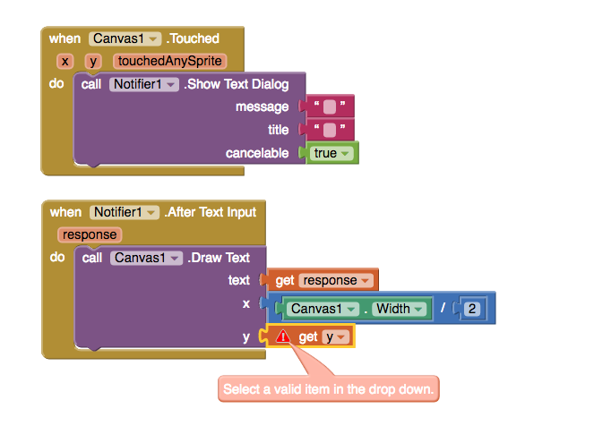

In the block above, we've successfully positioned the text in the middle of the screen, by dividing the canvas width by two. Unfortunately, we can not use the y value from the Canvas1.Touched event because, while it is a variable, is is a local variable and not a global variable. Local variables, like x, y and touchedAnySprite can only be used by the events or procedures that create them, whereas global variables can be used by any blocks of code on the screen. In the code below, we've fixed the problem by creating a global variable called text_position

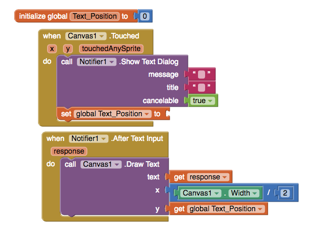

Finally, to complete the Snapchat effect, we add a background colour. To do create a transparent colour we need to add a fouth channel, known as an alpha channel. The alpha channel controls the opacity, or how see-through, a colour is.

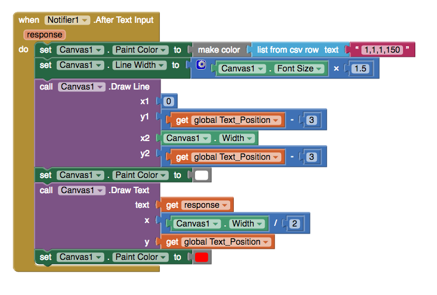

To understand what's going on, start at the top and work your way down. The blocks will run from top to bottom, and so quickly that it will be impossible for the user to notice any individual step. What they see is the end result.

First, we create a semi-transparent paint colour for the background;

Next, we change the line width to be 50% taller than the text;

After that the line is drawn, the &nbsp;Text_Position - 3 actually has the effect of moving the background up the screen, as y = 0 at the very top of the screen;

Next then, the paint colour is changed a second time, so that the text can be printed in white.

Now the text is displayed, just like we did in the previous example;

Finally, the Canvas1.PaintColor is changed back to the original colour so that the doodle function works as expected.

## 4. Filter

Image filtering, where you change the pixel data of the image itself, is not easy to acomplish at the moment in Thunkable. Dedicated image manipulation programs such as Photoshop or Pixlr are designed specifically for this sort of task, but our Canvas isn't really up to the job so we're going to have to think creatively. If you've ever been to the theatre or a concert you will have seen (though maybe not noticed!) lighting gels. These are basically bits of coloured plastic that go over stage lights to change the colour of the light.

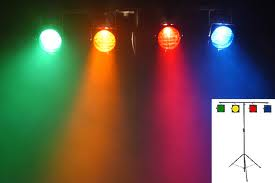

Using this approach we can achieve a very similar effect to the filters that you see in most social media apps. 

Before we begin let's do a checklist of what's required for a proof of concept:

1. The canvas paint colour should be transparent
2. The filter should be the full width and height of the canvas, i.e. no gaps around the edges.

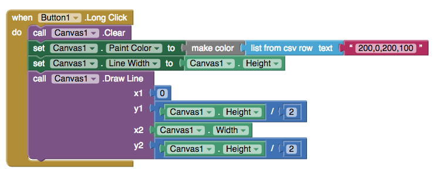

Now that we have one filter working we need to add some more. One way to do this might be with a random number generator, leaving the final filter colour up to chance, but a better way to acheieve consistent results is by creating our own list of filters and allowing the user to swipe through the filters. This will provide a more familiar user experience, while also ensuring that we get a nice selection of filter colours. 

To take the guesswork out of colour picking I've used the [material design reference guide](https://material.io/guidelines/style/color.html) by Google. I then did a Google search for the hex values of the colours I wanted and voila! RGB values for using in our app.

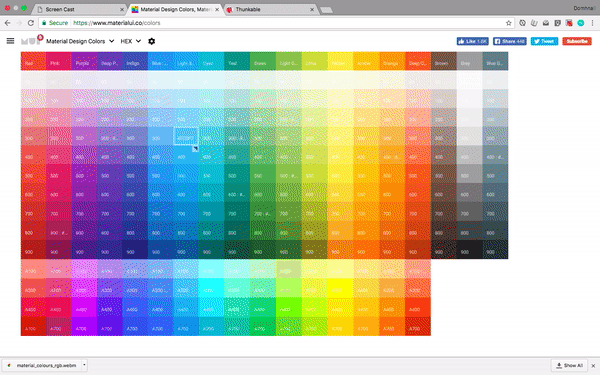

### Lists

Lists are integral components to almost all computer programs. A list is simply a collection of data, or variables, and sometimes you might see people referring to lists as "arrays" - which is just another word for a collection. 

Since we have a collection of filter colours that we want to use in our app this is an ideal time to learn how to use lists. The best practice is to use create empty list first, attaching this to a variable, and then when the app loads use the add items to list . 

Using the mutator you can add as many filter colours as you like.

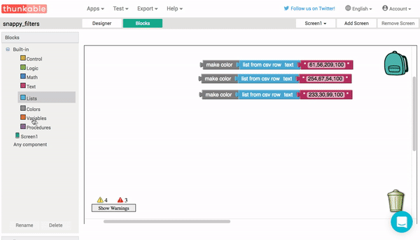

### Swipe Left and Right

To swipe between filters we're going to use the heading property of the Canvas1.Flung event. The heading tells us what direction the screen was swiped, but how exactly does your phone represent these directions? To better understand what happens when user swipes their finger across the screen we can make a test app. 

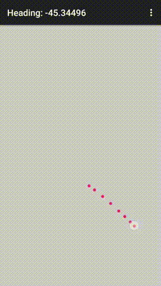

Making test apps like this is a good idea for any new feature that you want to better understand. Build an app that lets you visualise how the data change as new events occur. In this case I've displayed the results via the set Screen1.Title property, but you could just as easily use a label or notifier if you like. 

Once our test app is built we see that swiping up always gives a positive result, while swiping down gives a negative result. If you've ever done any co-ordinate geometry will make sense, since swiping upwards creates a line with a positive slope while swiping downwards draws a line with a negative slope. Similarly, when we swipe to the left the number is between 90 and 180 and swiping right returns a heading between 90 and 0, although we have to take into account the positive and negative signs.

To my mind, the range of values can be visualised like this:

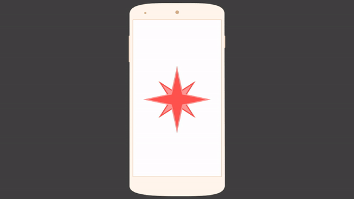

Back in our test app we can use the absolute value of the headings to determine whether the screen was swiped left or right. The absolute value, which is also sometimes refered to as the magnitude, ignores the sign of a number and just looks at the value.

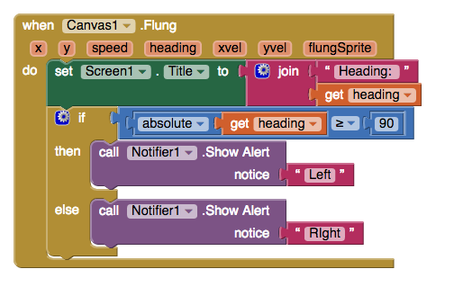

In the test app we now use the notifer to give a short alert of which direction the screen was swiped. In our Thunkchat app, we'll be using this information to move back and forth through the filters. 

<!--  -->

### List Index

Now that we have our list of filter colours, and the ability to track left and right swipes we need to keep track of which filter we are on. To do this we need to understand a litte bit about list indexes. The index a list is just the numeric position of each item in the list. In many programming langauges it is customary to start counting at 0 however in Thunkable, and other Blockly-based software, we start counting from 1. This means that the index of our first filter is 1, our second filter is 2 and so on. So, in order to create an index for our list of filters we just create a new variable, rename it filter_index or something similar, and initialise it with a starting value of 0.
If we combine the select list item block with our new filter index we can select any one of our three filters. 

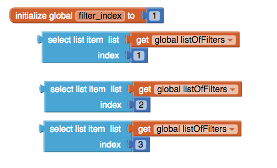

### Incrementers

In the previous example if we want to go from one filter to the next we add 1 to our filter index. Similarly, if we want to go backwards through the list we have to subtract 1 from the filter index. This is a common pattern in programming known as an incrementer. For our Thunkchat app, swiping left will add 1 for our filter index and swiping right will subtract one. 

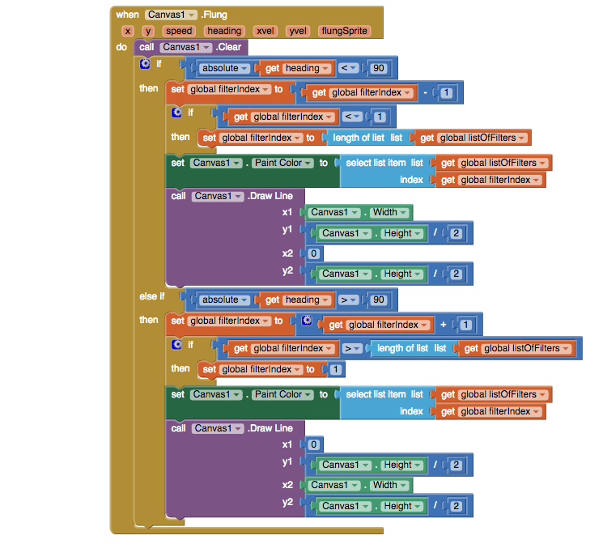

Take you time to go through the blocks and understand them. Each event throws up a number of possibilities so we have to take all of these things into consideration to make sure our app doesn't crash. One thing we do is check to see if we've run out of filters from our lists. If the filter index has got too big, we reset it to 0, and if the filter index has gone below 1 we loop back to the end of the list using length of listglobal listOfFilters Aside from that, it's really just a combination of everything we've already done in this section.

## 5. Geofilters

Now that we're comfortable with using the canvas, let's try a few sensors. In order to add location awareness and time-sensing capabilities to Thunkchat we're going to add a clock and a location sensor to our existing components. Here's what the updated component list should look like:
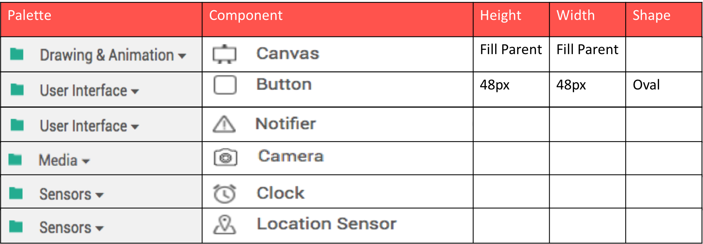

According to Snapchat:

>Geofilters are special overlays that communicate the “where and when” of a Snap in a fun way, whether you're sending it to a friend or adding it to your Story.

In Thunkchat we're going to show the time and location on the screen - even though the aesthetic will be a lot simpler, the functionality will be almost identical.

### Display the time

Before we display the time on the canvas we need to figure out how to format the time. There are a number of formats you can use, for example users who prefer 24-hour format can use the pattern HH:mm and for 12-hour format use lower case letters, hh:mm. 

You can use either of the following two snippets to display the time on the canvas:

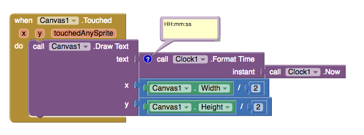
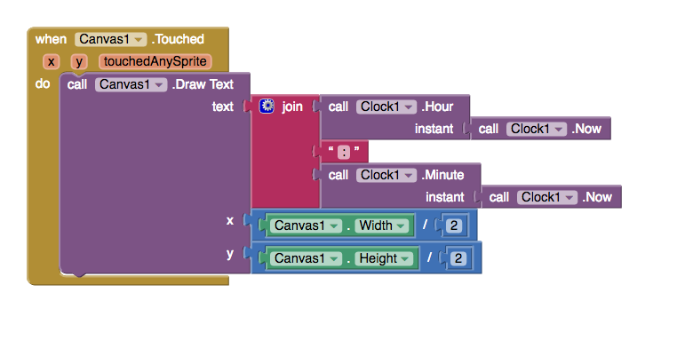

### Show the location

Within the location sensor you can access the latitude and longitude values for your current location as well as being able to tell you your current address. The Location_Sensor1.Current Address block tells you the street name, town name, city name, and postcode. For this application the exact street is probably too specific for most users so we can include either town or city.

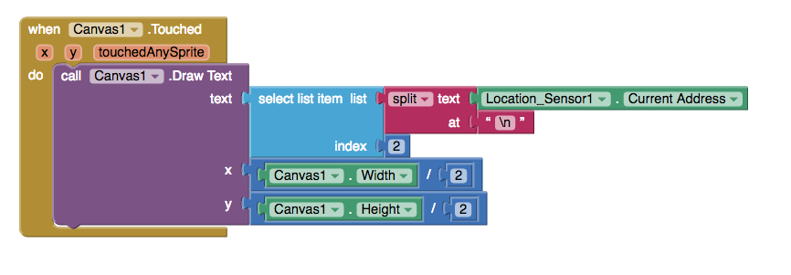 

In this snippet the split text at block uses the \n character to split the address into a list, where each element of the list corresponds to a line of the current address. For example, setting the index = 2 gives the current town, but if we use index = 3 the user should see the current city.

## Tidying it all up.

Now that we have it all working as we'd expect we can tidy the whole thing up by using a few ImageSprites. Doing this allows us to fill the entire screen with the canvas and lends itself to a better overall user experience. 

