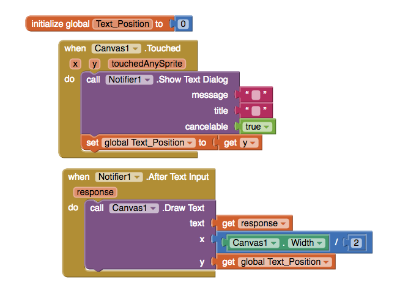

# Snapchat

In September 2011, three college students - working out of their dormroom in Stanford - revolutionised the messaging world with their app, Snapchat.

The viral app contains the following adictive features:

1. The ability to capture pictures,
2. Draw doodles,
3. Add text,
4. Filter images,  
5. Geotags,
6. Apply a timestamp,
7. Disappear after 30 seconds.

## 1. Capture & Display Pictures

We'll start with a simple prototype, and then add more components as we go when we need more funcitonality. Our initial design has a big canvas for displaying images and a circular button to take the picture. To create circcular buttons you need to change the shape to `oval` and set the height and width to be the same amount, i.e. 48px width and 48px height or 32px width and 32px height.

Taking a photo and displaying it on the screen is actually really easy. First of all, the button click event calls the `Camera1.Take Picture` method. This in turn opens the camera and lets the use take a photograph. Once the user has taken a picture this raises the `Camera1.After Picture` event. This event contains an `image` variable, which tells us the path to where the photo is stored on the phone. 

## 2. Draw a doodle

Drawing a line anywhere on the screen only takes 6 blocks. The dragged event is fired whenever the user drags their finger around the screen. 

You might remember from math(s) class  that a line is just the shortest distance between two points. Since a screen is just a collection of points basically all we're doing here is joining the dots. 

The canavs component gives us the option to change a wide variety of properties, such as paint color, font size and line width. 

## 3. Add Text

For our next feature we'll let the user add text to their image by tapping on the screen. We could do this with a TextBox, but a better option is to use a `Text Dialog`. 

In the block above, we've successfully positioned the text in the middle of the screen, by dividing the canvas width by two. Unfortunately, we can not use the y value from the `Canvas1.touched` event because, while it is a variable, is is a local variable and not a global variable. Local variables, like `x`, `y` and `touchedAnySprite` can only be used by the events or procedures that create them, whereas global variables can be used by any blocks of code on the screen. In the code below, we've fixed the problem by creating a global variable called `text_position`

Finally, to complete the Snapchat effect, we add a background colour. To do create a transparent colour we need to add a fouth channel, known as an alpha channel. The alpha channel controls the opacity, or how see-through, a colour is.

To understand what's going on, start at the top and work your way down. The blocks will run from top to bottom, and so quickly that it will be impossible for the user to notice any individual step. What they see is the end result.

First, we create a semi-transparent paint colour for the background;

Next, we change the line width to be 50% taller than the text;

After that the line is drawn, the `Text_Position - 3` actually has the effect of moving the background up the screen, as y = 0 at the very top of the screen;

Next then, the paint colour is changed a second time, so that the text can be printed in white;

Now the text is displayed, just like we did in the previous example;

Finally, the `Canvas1.PaintColor` is changed back to the original colour so that the doodle function works as expected.

## 4. Filter

## 5. Geotag

Now that we're comfortable with using the canvas, let's try a few sensors. For this app we're going to add in 

## 6. Timestamp

## 7. Disappearing Images

